## Introduccion


## Índice   
1. [Trabajo 1: CNN](#id1)
2. [Trabajo 2: Wally](#id2)
3. [Trabajo 3: Reconocedor de emociones](#id3)
4. [Trabajo 4: Juego phaser 3 bolas](#id4)
5. [Trabajo 5: Juego phaser 1 bola](#id5)

<!--  -->


## Trabajo 1: CNN <a name="id1"></a>
En la siguiente imagen se muestra cómo se organizaron las carpetas. Tenemos:

- Imágenes de riesgos: Contiene imágenes con un tamaño fijo de 28x21 píxeles.
- Videos: Carpeta donde guardamos todos los videos.
- Imágenes de prueba: Carpeta destinada a almacenar las imágenes de prueba.
- Scripts: Uno de los scripts se utiliza para extraer las imágenes de los videos, el otro script se encarga de generar el conocimiento.

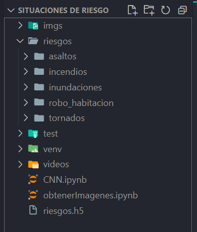

Vamos a ver el script que nos ayuda a obtener las fotos de los videos, se le pasa el video donde queremos sacar las fotos, despues cuando se oprima la tecla 'a', se toma la captura y se guarda en la ruta especificada.

```
import numpy as np
import cv2 as cv
import math 
import os 

cap = cv.VideoCapture("videos/tornado5.mp4")
i=0
while True:
    ret, frame = cap.read()
    if ret:
        cv.imshow('img', frame)
        k = cv.waitKey(30)  # Aumenta este valor para hacer que el video se reproduzca más lento
        if k == ord('a'):
            i=i+1    
            cv.imwrite('imgs/riesgo/tornado'+str(0 + i)+'.jpg', frame )
            
        if k == 27:
            break
    else:
        break
cap.release()
cv.destroyAllWindows()
```

Despues vamos a ver el script del CNN, en este punto se cargan las imagenes 

```
dirname = os.path.join(os.getcwd(),'riesgos/')
imgpath = dirname + os.sep 

images = []
directories = []
dircount = []
prevRoot=''
cant=0

print("leyendo imagenes de ",imgpath)

for root, dirnames, filenames in os.walk(imgpath):
    for filename in filenames:
        if re.search("\.(jpg|jpeg|png|bmp|tiff)$", filename):
            cant=cant+1
            filepath = os.path.join(root, filename)
            image = plt.imread(filepath)
            if(len(image.shape)==3):
                
                images.append(image)
            b = "Leyendo..." + str(cant)
            print (b, end="\r")
            if prevRoot !=root:
                print(root, cant)
                prevRoot=root
                directories.append(root)
                dircount.append(cant)
                cant=0
dircount.append(cant)

dircount = dircount[1:]
dircount[0]=dircount[0]+1
print('Directorios leidos:',len(directories))
print("Imagenes en cada directorio", dircount)
print('suma Total de imagenes en subdirs:',sum(dircount))
```
Despues de esto se tiene que crear el set de entrenamientos y el test, donde se nos muestra una imagen comparativa de otras dos imagenes de entrenaiento.

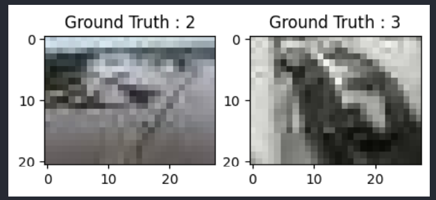

despues de hacer lo anterior se tienen que procesar las imagenes, Hacemos el One-hot Encoding para la red, se crea el set de entrenamiento y validacion, al igual que se crea el modelo CNN. Una vez realizado lo anterior entrenamos el modelo CNN para que pueda clasificar las imagenes. A hora veremos unas graficas para ver si nuestro modelo esta aprendiendo de manera correcta o le falta mas entrenamiento, en el caso de nuestra grafica nos hace falta un poco mas de entrenamiento.

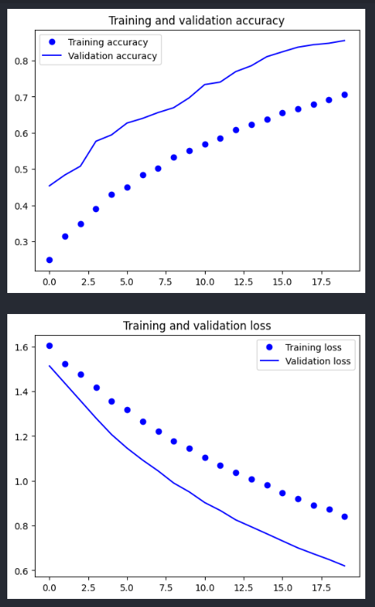

Despues se tiene que hacer que el modelo aprenda de los errores, despues se puede observar una matriz en donde nos indica la precicion con la que puede clasificar una imagen, en nuestro caso nos salio un poco bajo pero funcionable, se puede mejorar el dataset.

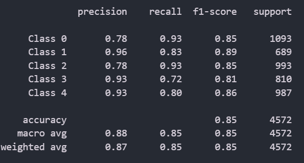

Por ultimo probamos y verificamos que el clasificador funcione de una manera correcta, se le pasara una imagen de un incendio con bastante ruido.

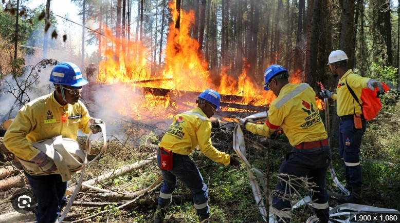

Al pasar esta imagen nos da como resultados lo siguiente:

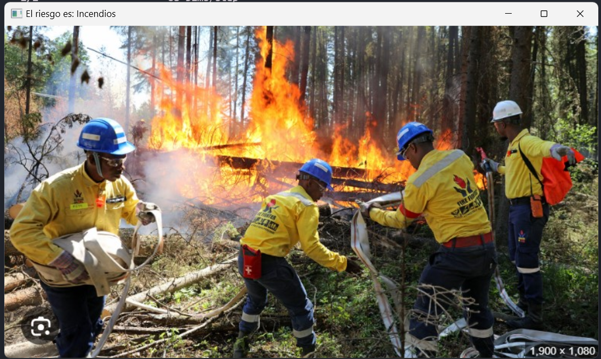

Nos podemos dar cuenta que si clasifica de una manera correcta.

## Trabajo 2: Wally<a name="id2"></a>
Para encontrar a wally tuvimos un orden similar que en el de CNN, como se muestra acontinuación:

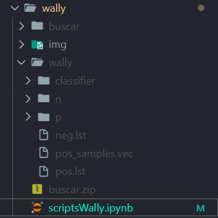

Tenemos una carpeta con imagenes de prueba que se llama buscar, despues la carpeta img contiene imaenes de las positivas y negativas tratadas con recortes, rotaciones de imagenes, cambio del tamaño, etc. por último tenemos la carpeta wally con las imagenes positivas en la carpeta p y las negativas en la carpeta n. A continuacion se mostrara uno de varios codigos que se utilizaron para poder generar nuestras imagenes.

Como se puede observar se cargan las imagenes y se llama a la funcion crop_and_resize y como su nombre lo indica hace un recorte de la imagen en este caso de 3 pixeles por cada lado y despues hace que la imagen se convierta de 50x50.

```
i = 0
imgPaths = 'wally/p'
#imgPaths = 'img/negativas'
nomFiles = os.listdir(imgPaths)
for nomFile in nomFiles:
    i = i+1
    imgPath=imgPaths+"/"+nomFile
    img = cv.imread(imgPath)
    convert_to_gray(img, i) 

def crop_and_resize(img, i):
    # Cargar la imagen
    img = cv.imread(img)

    # Recortar 2 píxeles de cada lado
    cropped_img = img[2:-3, 2:-3]

    # Redimensionar a 50x50 píxeles
    resized_img = cv.resize(cropped_img, (50, 50))

    # Guardar la imagen resultante
    cv.imwrite('wally/p/wallyCrop'+str(i)+'.png', resized_img)

```
Para poder generar el dataset se utilizo un programa llamado Cascade Traiger GUI version 3.3.1, se indicara lo que se realizo para poder obtener nuestro archivo xml

En el programa que se realizo solo se modificaron las opciones de 2 secciones, la primera fue la general en donde se indico la ruta de las carpetas n y p, despues se le indico que se usaran todas las imagenes positivas que fueron 120 y que las negativas eran 680.

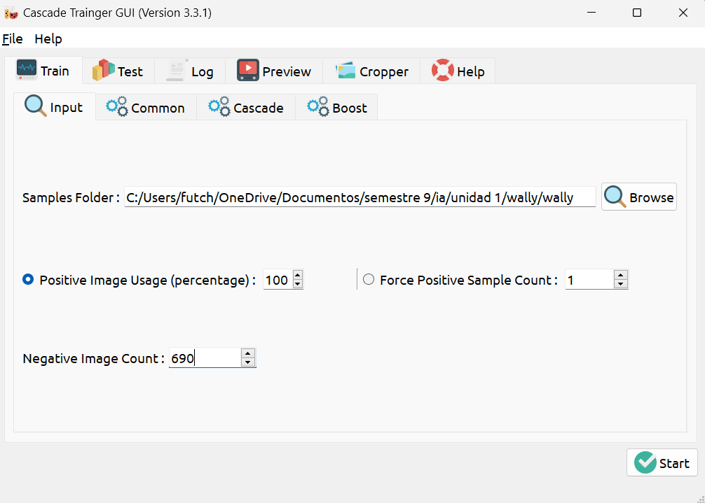

La otra interfaz que se modifico fue la de cascade y solo se ingresaron los datos del tamaño de la imagen que en nuestro caso la usamos de 28x21

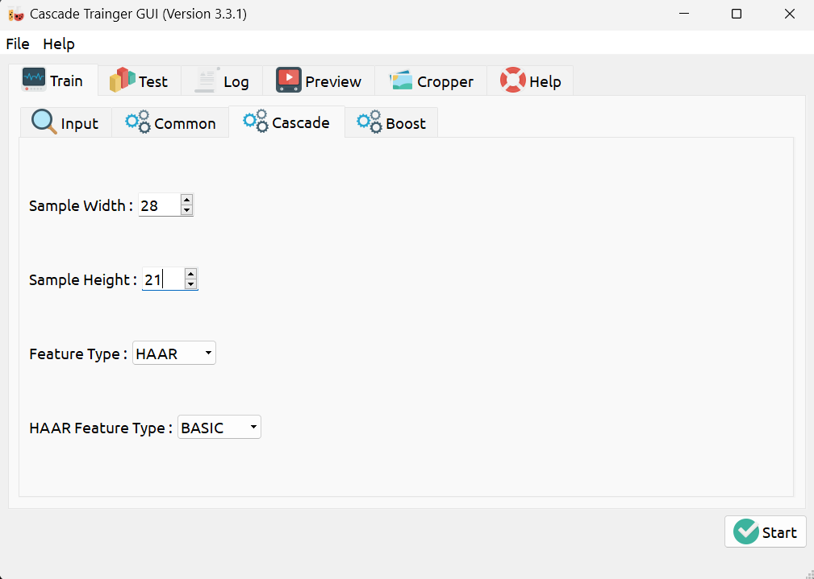

Una vez que se configuro todo se preciono el boton de start y cuando finalizo nos arrojo un xml llamado 'cascade.xml' que se usara para probar si se desarrollo bien el dataset. Para probarlo usamos el siguiente codigo:

```
import numpy as np
import cv2 as cv    
import math

wally = cv.CascadeClassifier('wally/classifier/cascade.xml')

frame = cv.imread('buscar/buscar1.png')

gray = cv.cvtColor(frame, cv.COLOR_BGR2GRAY)

wallys = wally.detectMultiScale(gray, 1.3, 100)

for (x, y, w, h) in wallys:
    frame = cv.rectangle(frame, (x,y), (x+w, y+h), (0, 255, 0), 2)

cv.imshow('Wally', frame)

cv.waitKey(0)
cv.destroyAllWindows()
```

En el codigo anteriro se carga el clasificador, despues se lee la imagen y se pasa a tonos grises, empieza a checar si se encuentra wally en la imagen, de encontrarlo se pinta un cuadrado verde indicando que se encontro wally, como lo vemos en el siguiente ejemplo:

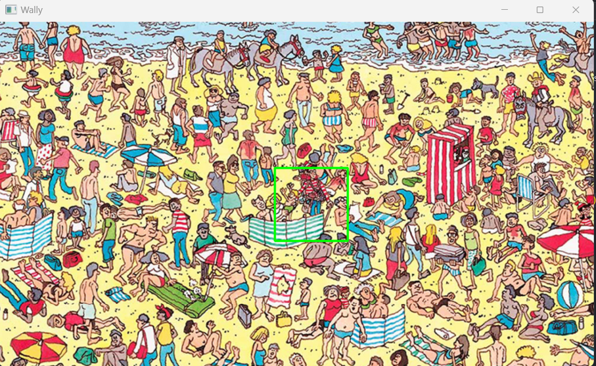


Como se puede observar si encontro a wally, solo que se tiene algunos errores de precision.

## Trabajo 3: Reconocedor de emociones<a name="id3"></a>

Para generar nuestro dataset de sentimientos, me ayudaron varios compañeros en total 7 compañeros para poder generalizar de una mejor manera las emociones, se usarion aproximadamente 1100 imagenes por cada carpeta de emociones, de la persona que use mas fotos fui yo ya que queri que la camara detectara bien mi resolucion de la camara de la laptop.

Se mostrara como estuvo nuestra organización de carpetas para un uso correcto de el dataset.

Aquí se muestr nuestra carpeta de sentimientos y las subcarpetas con las sentimientos a entrenar:
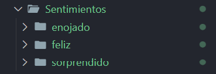


Despues vemos la carpeta de xmls donde se guarda nuestro dataset generado y por ultimo nuestro script para poder probar nuestro dataset.
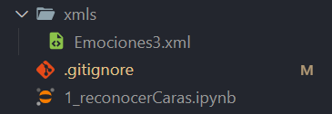

El siguiente codigo nos ayuda para poder tomar una imagen de nosotros cuando estamos haciendo una emocion, se repetia varias veces con diferentes luces para que no exisitiera tanto error en lo generado.

```
import cv2 as cv

# Cargar el clasificador de Haar para la detección de rostros
rostro = cv.CascadeClassifier('utils/haarcascade_frontalface_alt.xml')

# Iniciar la captura de vídeo desde la cámara
cap = cv.VideoCapture(0)

# Contador para el nombre de los archivos de salida
i = 0 

while True:
    # Capturar un fotograma de la cámara
    ret, frame = cap.read()
    
    # Convertir el fotograma a escala de grises
    gray = cv.cvtColor(frame, cv.COLOR_BGR2GRAY)
    
    # Detectar rostros en la imagen en escala de grises
    rostros = rostro.detectMultiScale(gray, 1.3, 5)
    
    # Iterar sobre cada rostro detectado
    for(x, y, w, h) in rostros:
        # Dibujar un rectángulo alrededor del rostro detectado en el fotograma original
        
        # Dibujar un rectángulo alrededor del rostro detectado en el fotograma original
        frame = cv.rectangle(frame, (x-20, y-20), (x+w+20, y+h+20), (0, 255, 0), 2)
        
        # Recortar el área del rostro detectado
        frame2 = frame[y:y+h, x:x+w]
        
        # Redimensionar el área del rostro a 100x100 píxeles
        frame2 = cv.resize(frame2, (100, 100), interpolation=cv.INTER_AREA)
        
        # Guardar el rostro redimensionado como una imagen PNG
        cv.imwrite('Sentimientos/sorprendido/sorprendidoNetoL{}.png'.format(i), frame2)
        
    # Mostrar el fotograma con los rostros detectados
    cv.imshow('Rostros', frame)
    
    # Incrementar el contador de archivos de salida
    i += 1
    
    # Esperar por la tecla ESC para salir del bucle
    k = cv.waitKey(1)
    if k == 27:
        break

# Liberar los recursos de la cámara y cerrar las ventanas
cap.release()
cv.destroyAllWindows()

```

Una vez obtenido las imagenes, procedemos a generar el archivo xml con el siguiente codigo:

```
import cv2 as cv 
import numpy as np 
import os

dataSet = 'Sentimientos/'
faces  = os.listdir(dataSet)
print(faces)

labels = []
facesData = []
label = 0 
for face in faces:
    facePath = dataSet+'/'+face
    for faceName in os.listdir(facePath):
        labels.append(label)
        facesData.append(cv.imread(facePath+'/'+faceName,0))
    label = label + 1
print(np.count_nonzero(np.array(labels)==0)) 

faceRecognizer = cv.face.EigenFaceRecognizer_create()
faceRecognizer.train(facesData, np.array(labels))
faceRecognizer.write('xmls/sentimientosEigerface.xml')
```

y el utlimo codigo que se utilizo es el siguiente, que nos permite cargar los modelos, y poder mostrar un video al mismo tiempo ir comprobando si hay una emocion del usuario en ese momento, si no se conoce la emocion simplemente dice que es desconocida la emocion.

```
import cv2 as cv
import os

# Verify that the Haar cascade file exists
cascade_path = 'utils/haarcascade_frontalface_alt.xml'
# Initialize face recognizer
faceRecognizer = cv.face.LBPHFaceRecognizer_create()
# Read the trained model
model_path = "xmls/Emociones3.xml"
faceRecognizer.read(model_path)

# Define emotion labels
faces = ["enojo", "feliz", "sorpresa"]

# Initialize video capture
cap = cv.VideoCapture(0)

# Load the Haar cascade for face detection
rostro = cv.CascadeClassifier(cascade_path)

while True:
    ret, frame = cap.read()
    
    gray = cv.cvtColor(frame, cv.COLOR_BGR2GRAY)
    cpGray = gray.copy()
    rostros = rostro.detectMultiScale(gray, 1.3, 3)
    
    for (x, y, w, h) in rostros:
        frame2 = cpGray[y:y+h, x:x+w]
        frame2 = cv.resize(frame2, (100, 100), interpolation=cv.INTER_CUBIC)
        result = faceRecognizer.predict(frame2)
        
        # Display the prediction result
        if result[1] < 100:
            cv.putText(frame, f'{faces[result[0]]}', (x, y-25), 2, 1.1, (0, 255, 0), 1, cv.LINE_AA)
            cv.rectangle(frame, (x, y), (x+w, y+h), (0, 255, 0), 2)
        else:
            cv.putText(frame, 'Desconocido', (x, y-20), 2, 0.8, (0, 0, 255), 1, cv.LINE_AA)
            cv.rectangle(frame, (x, y), (x+w, y+h), (0, 0, 255), 2)
    
    cv.imshow('frame', frame)
    if cv.waitKey(1) == 27:  # Press 'ESC' to exit
        break

cap.release()
cv.destroyAllWindows()
```

Se mostraran los resultados obtenidos 

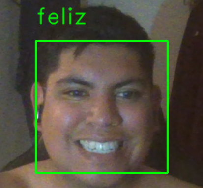

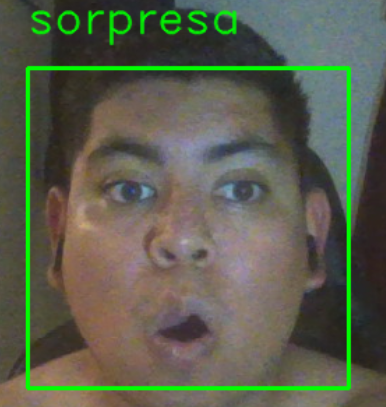

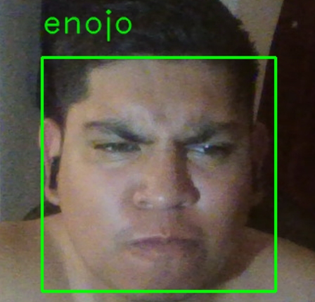


## Trabajo 4: Juego phaser 3 bolas<a name="id4"></a>
Para poder explicar de una mejor manera este trabajo se mostraran los codigos que se usaron y una breve explicación de lo que hacen las funciones.

Carga todos los recursos necesarios para el juego, como son las imágenes.

```
function preload() {
    juego.load.image('fondo', 'assets/game/fondo.png');
    juego.load.spritesheet('jugador', 'assets/sprites/p3.png', 34, 48);
    juego.load.image('nave', 'assets/game/nave.png');
    juego.load.image('bala', 'assets/sprites/ball.png');
    juego.load.image('menu', 'assets/game/menu.png');
}
```

Inicializa el juego configurando las propiedades físicas, creando los sprites (jugador, fondo, balas, naves), y estableciendo las teclas de control y las redes neuronales, se utilizaron 3 redes neuronales las cuales van a aprender diferentes cosas, una aprende cuando saltar, otra cuando moverse a la izquierda y la otra cuando moverse a la derecha, 2 de las redes neuronales tiene como entrada 2 datos y 2 capas ocultas de 8 cada una, de salidas solo se tiene 1, la otra red neuronal solo varia en las entradas ya que acepta 1 mas.

```
function create() {
    juego.physics.startSystem(Phaser.Physics.ARCADE);
    juego.physics.arcade.gravity.y = 800;
    juego.time.desiredFps = 30;

    fondo = juego.add.tileSprite(0, 0, anchoJuego, altoJuego, 'fondo');

    nave1 = juego.add.sprite(anchoJuego - 110, altoJuego - 55, 'nave');
    nave2 = juego.add.sprite(anchoJuego - 800, altoJuego - 400, 'nave');
    nave3 = juego.add.sprite(anchoJuego - 200, altoJuego - 400, 'nave');

    jugador = juego.add.sprite(50, altoJuego, 'jugador');

    juego.physics.enable(jugador);
    jugador.body.collideWorldBounds = true;
    var animacionCorrer = jugador.animations.add('correr', [0, 1]);
    jugador.animations.play('correr', 6, true);

    bala1 = juego.add.sprite(anchoJuego - 100, altoJuego, 'bala');
    juego.physics.enable(bala1);
    bala1.body.collideWorldBounds = true;

    bala2 = juego.add.sprite(anchoJuego - 750, altoJuego - 350, 'bala');
    juego.physics.enable(bala2);
    bala2.body.collideWorldBounds = false;

    bala3 = juego.add.sprite(bala3PosX, bala3PosY, 'bala');
    juego.physics.enable(bala3);
    bala3.body.collideWorldBounds = false;

    etiquetaPausa = juego.add.text(anchoJuego - 430, 10, 'Pausa', { font: '20px Arial', fill: '#fff' });
    etiquetaPausa.inputEnabled = true;
    etiquetaPausa.events.onInputUp.add(pausarJuego, self);
    juego.input.onDown.add(reanudarJuego, self);

    teclaSaltar = juego.input.keyboard.addKey(Phaser.Keyboard.SPACEBAR);
    teclaIzquierda = juego.input.keyboard.addKey(Phaser.Keyboard.A);

    teclaIzquierda.onUp.add(detenerMovimiento, this);

    redNeuronalSaltar = new synaptic.Architect.Perceptron(2, 6, 6, 1);
    entrenamientoSaltar = new synaptic.Trainer(redNeuronalSaltar);

    redNeuronalMoverIzquierda = new synaptic.Architect.Perceptron(3, 6, 6, 1);
    entrenamientoMoverIzquierda = new synaptic.Trainer(redNeuronalMoverIzquierda);

    redNeuronalMoverDerecha = new synaptic.Architect.Perceptron(2, 6, 6, 1);
    entrenamientoMoverDerecha = new synaptic.Trainer(redNeuronalMoverDerecha);
}
```

En las siguientes funciones se reinicia algunos valores, como lo son las balas o el jugador.

```
function resetearVariablesJuego() {
    jugador.body.velocity.x = 0;
    jugador.body.velocity.y = 0;
    bala1.body.velocity.x = 0;
    bala1.position.x = anchoJuego - 100;
    sonidoDisparo1.play();
    balaDisparada = false;
}

const reiniciarBala2 = () => {
    bala2.position.x = anchoJuego - 750;
    bala2.body.position.y = 5;
    bala2.body.velocity.y = velocidadBala2;
    sonidoDisparo2.play();
};

const reiniciarPosicionBala3 = () => {
    bala3.position.x = bala3PosX;
    bala3.position.y = bala3PosY;
    sonidoDisparo3.play();
};
```


Entrena las redes neuronales para las acciones de saltar, mover a la izquierda y mover a la derecha utilizando los datos de entrenamiento recolectados.

```
function entrenarRedNeuronal() {
    entrenamientoSaltar.train(datosEntrenamientoSaltar, { rate: 0.0003, iterations: 5000, shuffle: true });
    entrenamientoMoverIzquierda.train(datosEntrenamientoMoverIzquierda, { rate: 0.0003, iterations: 5000, shuffle: true });
    entrenamientoMoverDerecha.train(datosEntrenamientoMoverDerecha, { rate: 0.0003, iterations: 5000, shuffle: true });
}
```

En las siguientes funciones se obtine la salida de las redes neuronales, en las 3 funciones se devuelve verdadero si el jugador debe de realizar una accion, para obtener esta salida se basan en los parametros de entrada.

```
function obtenerDatosSaltar(parametrosEntrada) {
    salidaRedNeuronal = redNeuronalSaltar.activate(parametrosEntrada);
    var porcentajeAire = Math.round(salidaRedNeuronal[0] * 100);
    return porcentajeAire >= 40;
}

function obtenerDatosMoverIzquierda(parametrosEntrada) {
    salidaRedNeuronalMoverIzquierda = redNeuronalMoverIzquierda.activate(parametrosEntrada);    
    const resultado = Math.round(salidaRedNeuronalMoverIzquierda[0] * 100);
    console.log("RN Mover Izquierda", salidaRedNeuronalMoverIzquierda, resultado);
    return resultado > 20;
}

function obtenerDatosMoverDerecha(parametrosEntrada) {
    salidaRedNeuronalMoverDerecha = redNeuronalMoverDerecha.activate(parametrosEntrada);
    const resultado = Math.round(salidaRedNeuronalMoverDerecha[0] * 100);
    console.log("RN Mover Derecha", salidaRedNeuronalMoverDerecha, resultado);
    return resultado >= 9;
}
```

En las dos funciones es para pausar el juego y reanudarlo, en la funcion de reanudarJuego, se observa que si se le da clic a reanudar en modo manual cambia valores para que no comienze en modo auto, al contrario de que si se presiona modo auto se cambia las variable spara que este en modo auto y entrene la red neuronal.

```
function pausarJuego() {
    juego.paused = true;
    menuPausa = juego.add.sprite(anchoJuego / 2, altoJuego / 2, 'menu');
    menuPausa.anchor.setTo(0.5, 0.5);
    sonidoPausa.play();
}

function reanudarJuego(evento) {
    if (juego.paused) {
        var menuX1 = anchoJuego / 2 - 270 / 2, menuX2 = anchoJuego / 2 + 270 / 2,
            menuY1 = altoJuego / 2 - 180 / 2, menuY2 = altoJuego / 2 + 180 / 2;

        var mouseX = evento.x,
            mouseY = evento.y;

        if (mouseX > menuX1 && mouseX < menuX2 && mouseY > menuY1 && mouseY < menuY2) {
            if (mouseX >= menuX1 && mouseX <= menuX2 && mouseY >= menuY1 && mouseY <= menuY1 + 90) {
                entrenamientoCompleto = false;
                datosEntrenamientoSaltar = [];
                modoAutomatico = false;
            } else if (mouseX >= menuX1 && mouseX <= menuX2 && mouseY >= menuY1 + 90 && mouseY <= menuY2) {
                if (!entrenamientoCompleto) {
                    entrenarRedNeuronal();
                    entrenamientoCompleto = true;
                    jugador.position.x = 50;
                }
                modoAutomatico = true;
            }
            menuPausa.destroy();
            resetearVariablesJuego();
            juego.paused = false;
        }
    }
}
```

Las siguientes funciones sirven para poder hacer una accion, saltar, moverse a la izquierda o derecha, al igual que para quedarse quieto.


```
function saltar() {
    sonidoSaltar.play();
    jugador.body.velocity.y = -270;
}

const moverDerecha = () => {
    if (jugador.body.position.x > 100) return;
    jugador.body.position.x = 50;
    jugador.body.position.y = 400;

    estadoDerecha = 1;
    estadoIzquierda = 0;
    moviendoIzquierda = false;
    estadoTemporal = 1;
};

const moverIzquierda = () => {
    jugador.body.velocity.x = -80;
    estadoDerecha = 0;
    estadoIzquierda = 1;
    moviendoIzquierda = true;
};

function detenerMovimiento() {
    if (!modoAutomatico && jugador.body.onFloor()) {
        jugador.body.velocity.x = 0;
    }
}
```

En la funcion de update se actualiza el estado del juego en cada frame, gestionando las colisiones, movimientos y acciones del jugador y los objetos del juego.

```
function update() {
    fondo.tilePosition.x -= 1;
    juego.physics.arcade.collide(bala1, jugador, manejarColision, null, this);
    juego.physics.arcade.collide(bala2, jugador, manejarColision, null, this);
    juego.physics.arcade.collide(bala3, jugador, manejarColision, null, this);

    bala3.body.velocity.y = 80;
    bala3.body.position.x -= 5;

    enSuelo = 1;
    enAire = 0;

    estadoDerecha = 0;
    estadoIzquierda = 0;

    if (!jugador.body.onFloor()) {
        enSuelo = 0;
        enAire = 1;
        moverDerechaEnAire = 1;
    } else {
        moverDerechaEnAire = 0;
    }

    if (bala3.position.x <= 0) {
        reiniciarPosicionBala3();
    }

    desplazamientoBala = Math.floor(jugador.position.x - bala1.position.x);
    desplazamientoBala2 = Math.floor(jugador.position.y - bala2.position.y);
    desplazamientoBala3 = Math.floor(jugador.position.x - bala3.position.x);
    desplazamientoBala3b = Math.floor(jugador.position.y - bala3.position.y);

    if (!modoAutomatico && teclaSaltar.isDown && jugador.body.onFloor()) {
        saltar();
    }

    if (!modoAutomatico && teclaIzquierda.isDown) {
        moverIzquierda();
    }

    if (moviendoIzquierda) {
        if (bala1.body.position.x > 600 && bala2.body.position.y < 280 && bala3.body.position.y < 280) {
            moverDerecha();
        }
    }

    if (modoAutomatico && bala2.position.y > 200) {
        const resultado = obtenerDatosMoverIzquierda([desplazamientoBala2, jugador.position.x, bala2.position.x]);
        if (resultado) {
            moverIzquierda();
        }
    }

    if (modoAutomatico && bala3.position.y > 300 && bala3.position.x > 0) {
        if (obtenerDatosMoverDerecha([desplazamientoBala3, desplazamientoBala3b])) {
            moverIzquierda();
            console.log("RN Mover Izquierda");
        }
    }

    if (modoAutomatico && bala1.position.x > 0 && jugador.body.onFloor()) {
        if (obtenerDatosSaltar([desplazamientoBala, velocidadBala])) {
            saltar();
        }
    }

    bala2.body.velocity.y = velocidadBala2;

    if (bala2.body.position.y <= 0) {
        bloqueIA = false;
    }

    if (!balaDisparada) {
        disparar();
    }

    if (bala1.position.x <= 0) {
        resetearVariablesJuego();
    }
    if (bala2.position.y >= 380) {
        reiniciarBala2();
    }

    if (!modoAutomatico && bala2.position.y > 100 && desplazamientoBala2 > 0) {
        datosEntrenamientoMoverIzquierda.push({
            'input': [desplazamientoBala2, jugador.position.x, bala2.position.x],
            'output': [estadoIzquierda]
        });
    }

    if (!modoAutomatico && bala3.position.y > 200 && bala3.position.x > 0) {
        datosEntrenamientoMoverDerecha.push({
            'input': [desplazamientoBala3, desplazamientoBala3b],
            'output': [estadoIzquierda]
        });
    }

    if (!modoAutomatico && bala1.position.x > 0) {
        datosEntrenamientoSaltar.push({
            'input': [desplazamientoBala, velocidadBala],
            'output': [enAire]
        });
    }
}
```

Dispara la bala principal configurando su velocidad y dirección, se maneja las colisiones del jugador con las balas, pausando el juego y reproduciendo el sonido de "game over" y por ultimo devuelve una velocidad aleatoria dentro del rango especificado.

```
function disparar() {
    const max = modoAutomatico ? 700 : 500;
    velocidadBala = -1 * obtenerVelocidadAleatoria(300, max);
    bala1.body.velocity.y = 0;
    bala1.body.velocity.x = velocidadBala;
    balaDisparada = true;
}

function manejarColision() {
    pausarJuego();
    reiniciarPosicionBala3();
    reiniciarBala2();
    sonidoGameOver.play();
    jugador.position.x = 50;
}

function obtenerVelocidadAleatoria(min, max) {
    return Math.floor(Math.random() * (max - min + 1)) + min;
}
```

Por último se muestra una imagen de como quedo el juego de phaser de 3 bolas.

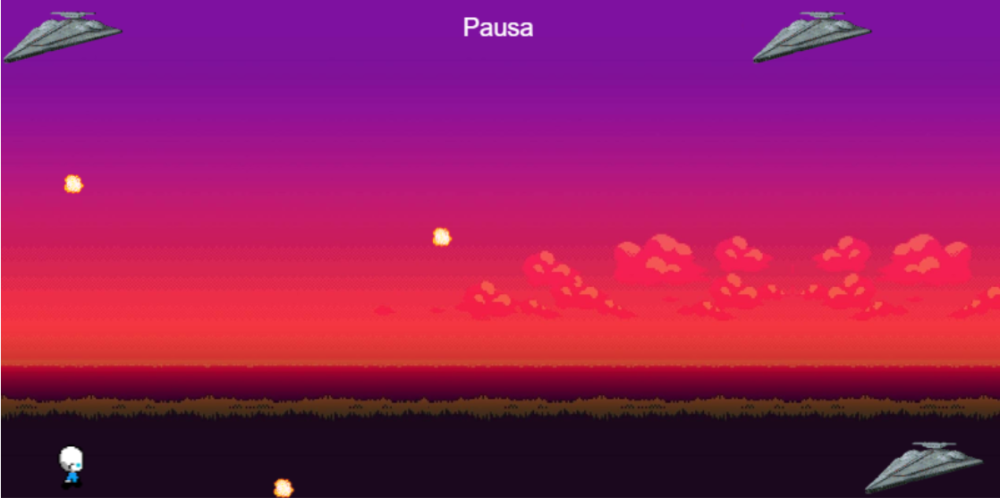


## Trabajo 5: Juego phaser 1 bola<a name="id5"></a>
Para poder explicar de una mejor manera este trabajo se mostraran los codigos que se usaron y una breve explicación de lo que hacen las funciones.

Carga las imágenes y sprites necesarios para el juego.

```
function preload() {
    juego.load.image('fondo', 'assets/game/fondo.png');
    juego.load.spritesheet('mono', 'assets/sprites/p2.png', 34, 48);
    juego.load.image('menu', 'assets/game/menu.png');
    juego.load.image('bala', 'assets/sprites/wizball.png');
}
```

Inicializa la física del juego, establece el fondo y el jugador, y posiciona una bala en una ubicación aleatoria. También configura los controles del teclado y crea una red neuronal.

```
function create() {
    juego.physics.startSystem(Phaser.Physics.ARCADE);
    juego.time.desiredFps = 30;

    fondo = juego.add.tileSprite(0, 0, w, h, 'fondo');
    jugador = juego.add.sprite(w / 2, h / 2, 'mono');
    juego.physics.enable(jugador);
    jugador.body.collideWorldBounds = true;
    var corre = jugador.animations.add('corre', [8, 9, 10, 11]);
    jugador.animations.play('corre', 10, true);

    
    var random = Math.floor(Math.random() * 4);
    switch (random){
        case 0:
            bala = juego.add.sprite(0, 0, 'bala');
            break;
        case 1:
            bala = juego.add.sprite(w, 0, 'bala');
            break;
        case 2:
            bala = juego.add.sprite(0, h, 'bala');
            break;
        default:
            bala = juego.add.sprite(w, h, 'bala');
            break;
    }

    juego.physics.enable(bala);
    bala.body.collideWorldBounds = true;
    bala.body.bounce.set(1);
    setBalaVelocity();

    pausaL = juego.add.text(w - 100, 20, 'Pausa', { font: '20px Arial', fill: '#fff' });
    pausaL.inputEnabled = true;
    pausaL.events.onInputUp.add(pausa, self);
    juego.input.onDown.add(mPausa, self);

    keyA = juego.input.keyboard.addKey(Phaser.Keyboard.A);
    keyW = juego.input.keyboard.addKey(Phaser.Keyboard.W);
    keyD = juego.input.keyboard.addKey(Phaser.Keyboard.D);
    keyS = juego.input.keyboard.addKey(Phaser.Keyboard.S);

    // Incrementamos la cantidad de neuronas y capas ocultas
    nnNetwork = new synaptic.Architect.Perceptron(2, 8, 8, 4);
    nnEntrenamiento = new synaptic.Trainer(nnNetwork);
}
```

Entrena la red neuronal con los datos de entrenamiento usando una tasa de aprendizaje y un número específico de iteraciones.

```
function enRedNeural() {
    nnEntrenamiento.train(datosEntrenamiento, {
        rate: 0.01,
        iterations: 4000,
        shuffle: true,
        log: 4000,
        cost: synaptic.Trainer.cost.CROSS_ENTROPY
    });
}
```

Calcula la salida de la red neuronal basada en la entrada y determina el movimiento del jugador (Izquierda, Derecha, Arriba, Abajo) según el valor máximo de la salida.

```
function datosMovimiento(param_entrada) {
    nnSalida = nnNetwork.activate(param_entrada);

    var Izq = nnSalida[0];
    var Der = nnSalida[1];
    var Arr = nnSalida[2];
    var Aba = nnSalida[3];

    var valores = [Izq, Der, Arr, Aba];
    var maximo = Math.max.apply(null, valores);

    console.log('first')
    console.log(maximo)
    console.log(Izq+'   '+Der+'   '+Arr+'   '+Aba)

    if (maximo >= 0.05){
        if (maximo === Izq) return "Izq";
        if (maximo === Der) return "Der";
        if (maximo === Arr) return "Arr";
        if (maximo === Aba) return "Aba";
    }else{
        return null
    }
    
}
```

Determina en qué cuadrante se encuentra un punto (x, y) en relación al origen.

```
function getCuadrante(x, y) {
    if (x > 0 && y < 0) {
        return 1;
    } else if (x < 0 && y < 0) {
        return 2;
    } else if (x < 0 && y > 0) {
        return 3;
    } else if (x > 0 && y > 0) {
        return 4;
    }

    return 0
}
```

Actualiza la posición y velocidad del jugador y la bala, controla el movimiento automático o manual del jugador, y recopila datos de entrenamiento.

```
function update() {
    fondo.tilePosition.x -= 0;
    juego.physics.arcade.collide(bala, jugador, colisionH, null, this);

    var dx = (bala.x - jugador.x) / w;
    var dy = (bala.y - jugador.y) / h;
    var distancia = Math.sqrt(dx * dx + dy * dy);

    var bDx = bala.x - jugador.x;
    var bDy = bala.y - jugador.y;
    var cuadrante = getCuadrante(bDx, bDy)

    if (autoMode) {
        if (distancia < 0.25) {
            var movimiento = datosMovimiento([cuadrante, distancia]);
            console.log('movimiento')
            console.log(distancia)
            if (movimiento === 'Izq') {
                jugador.body.velocity.x = -300;
            } else if (movimiento === 'Der') {
                jugador.body.velocity.x = 300;
            } else if (movimiento === 'Arr') {
                jugador.body.velocity.y = -300;
            } else if (movimiento === 'Aba') {
                jugador.body.velocity.y = 300;
            }
        } else if (distancia >= 0.2 && distancia <= 0.4) {
            jugador.body.velocity.setTo(0, 0);
        } 
            else if (distancia > 0.4 && distancia <= 5) {
                var speed = 200;
                var angle = Math.atan2((h / 2) - jugador.y, (w / 2) - jugador.x);
                jugador.body.velocity.x = speed * Math.cos(angle);
                jugador.body.velocity.y = speed * Math.sin(angle);

                if (Math.abs(jugador.x - w / 2) < 5 && Math.abs(jugador.y - h / 2) < 5) {
                    jugador.body.velocity.setTo(0, 0);
                    jugador.x = w / 2;
                    jugador.y = h / 2;
                }
            }else if (distancia > 4) {
                jugador.body.velocity.setTo(0, 0);
            } 
    } else {
        jugador.body.velocity.setTo(0, 0);
        estatusIzquierda = estatusDerecha = estatusArriba = estatusAbajo = 0;

        if (keyA.isDown) {
            jugador.body.velocity.x = -300;
            estatusIzquierda = 1;
        } else if (keyD.isDown) {
            jugador.body.velocity.x = 300;
            estatusDerecha = 1;
        }

        if (keyW.isDown) {
            jugador.body.velocity.y = -300;
            estatusArriba = 1;
        } else if (keyS.isDown) {
            jugador.body.velocity.y = 300;
            estatusAbajo = 1;
        }
    }

    if (!autoMode && bala.position.x > 0) {
        datosEntrenamiento.push({
            'input': [cuadrante, distancia],
            'output': [estatusIzquierda, estatusDerecha, estatusArriba, estatusAbajo]
        });

        console.log(estatusIzquierda+'   '+estatusDerecha+'   '+estatusAbajo+'   '+estatusAbajo)
    }
}
```

Pausa el juego y muestra un menú de pausa y maneja los eventos de clic mientras el juego está en pausa, permitiendo reanudar el juego o reiniciar la red neuronal y el juego.

```
function pausa() {
    juego.paused = true;
    menu = juego.add.sprite(w / 2, h / 2, 'menu');
    menu.anchor.setTo(0.5, 0.5);
}

function mPausa(event) {
    if (juego.paused) {
        var menu_x1 = w / 2 - 270 / 2, menu_x2 = w / 2 + 270 / 2,
            menu_y1 = h / 2 - 180 / 2, menu_y2 = h / 2 + 180 / 2;

        var mouse_x = event.x, mouse_y = event.y;

        if (mouse_x > menu_x1 && mouse_x < menu_x2 && mouse_y > menu_y1 && mouse_y < menu_y2) {
            if (mouse_y <= menu_y1 + 90) {
                eCompleto = false;
                datosEntrenamiento = [];
                autoMode = false;
                resetGame2();
                resetNeuralNetwork();  // Reiniciar la red neuronal aquí
            } else {
                if (!eCompleto) {
                    // agruparDatos = agruparDatos.concat(datosEntrenamiento);
                    enRedNeural();
                    eCompleto = true;
                }
                resetGame();
                autoMode = true;
            }
            menu.destroy();
            juego.paused = false;
        }
    }
}
```

Establece la velocidad inicial de la bala.

```
function setBalaVelocity() {
    bala.body.velocity.setTo(130, 190);
}
```

Coloca la bala en una posición aleatoria en uno de los cuatro extremos de la pantalla.

```
function setRandomPositionBala() {
    var random = Math.floor(Math.random() * 4);
    switch (random){
        case 0:
            bala.x = 0;
            bala.y = 0;
            break;
        case 1:
            bala.x = 600;
            bala.y = 0;
            break;
        case 2:
            bala.x = 0;
            bala.y = 600;
            break;
        default:
            bala.x = 600;
            bala.y = 600;
            
            break;
    }
    
    // bala.x = 0;
    // bala.y = 0;
}

function setRandomPositionBala2() {
    switch (contador){
        case 0:
            bala.x = 0;
            bala.y = 0;

            contador = contador + 1;
            break;
        case 1:
            bala.x = 600;
            bala.y = 0;
            contador = contador + 1;
            break;
        case 2:
            bala.x = 0;
            bala.y = 600;
            contador = contador + 1;
            break;
        default:
            bala.x = 600;
            bala.y = 600;
            contador = 0;
            break;
    }
    
}
```

Reinicia el juego posicionando al jugador en el centro y colocando la bala en una posición aleatoria con una velocidad inicial.

```
function resetGame() {
    jugador.x = w / 2;
    jugador.y = h / 2;
    jugador.body.velocity.setTo(0, 0);
    setRandomPositionBala();
    setBalaVelocity();
}

function resetGame2() {
    jugador.x = w / 2;
    jugador.y = h / 2;
    jugador.body.velocity.setTo(0, 0);
    setRandomPositionBala2();
    setBalaVelocity();
}
```

Por último se muestra una imagen de como quedo el juego de phaser esquivar la bala.

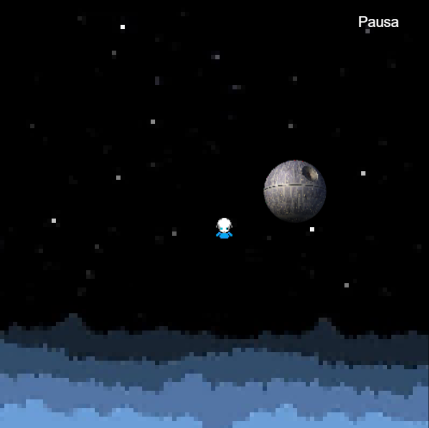


